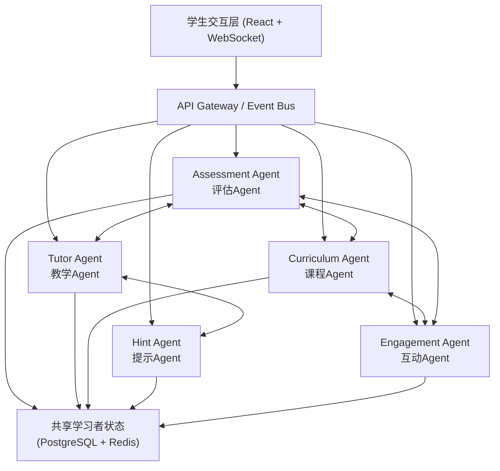
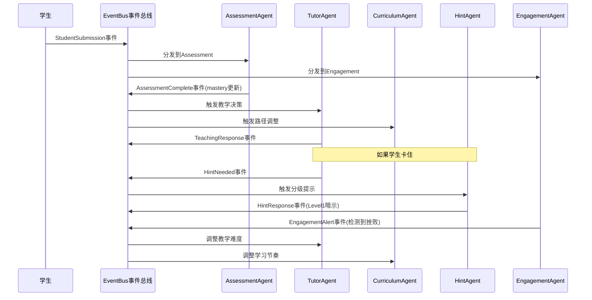

# 多Agent智能教育与个性化学习系统 -- 完整实施计划

## 一、调研结论与参考架构

### 1.1 企业级参考项目

| 框架/项目 | 语言 | Stars | 核心特点 |
不使用表格，改用列表：

**Python 生态**
- **CrewAI** (47,930 stars) -- 企业级多Agent协作框架，支持 Crews + Flows 混合编排
- **LangGraph** (by LangChain) -- StateGraph 状态机驱动，Supervisor/Swarm/Mesh多种编排模式
- **Solace Agent Mesh** (2,820 stars) -- 事件驱动多Agent架构，Agent间消息总线通信
- **Swarms** (6,196 stars) -- 企业级分布式Agent编排，99.9%+可用性

**Java 生态**
- **Spring AI** (8,335 stars) -- Spring生态AI框架，企业级Java Agent支持
- **SwarmAI** (基于Spring AI) -- 783测试通过，类型安全状态管理，Mermaid流程图生成
- **Autogen4j** -- 微软AutoGen的Java移植版，Java 17+

**Go 生态**
- **AgenticGoKit** (v0.5.6) -- Go多Agent编排框架，DAG/并行/循环模式
- **Gollem** (v0.3.1) -- 编译期类型安全，Generic Agent[T]
- **aixgo** (v0.7.1) -- 6种Agent类型，13种编排模式

**学术参考**
- **IntelliCode** (EACL 2026) -- 6个专业Agent + StateGraph编排器 + 集中式学习者模型，与我们的设计高度吻合
- **KELE** (EMNLP 2025) -- 苏格拉底式教学多Agent框架
- **EduAgentQG** -- 个性化问题生成5-Agent迭代协作

### 1.2 我们的架构设计 (借鉴IntelliCode + Solace Agent Mesh)



**编排模式**: Mesh + 事件驱动
- Agent之间通过事件总线双向通信（非中心化调度）
- 共享学习者状态采用单写者策略，确保原子性更新
- 每个Agent订阅感兴趣的事件类型，按需响应

## 二、项目目录结构

```
multi-agent-education/
├── README.md                        # 超详细README（面向小白）
├── docs/
│   ├── architecture.md              # 架构设计文档
│   ├── interview-guide.md           # 面试完整指南（八股文+STAR+简历）
│   ├── knowledge-points.md          # 200+知识点体系
│   └── deployment.md                # 部署指南
├── python/                          # Python实现（主力版本）
│   ├── README.md
│   ├── requirements.txt
│   ├── agents/
│   │   ├── base_agent.py            # Agent基类 + 事件总线
│   │   ├── assessment_agent.py      # 评估Agent
│   │   ├── tutor_agent.py           # 苏格拉底式教学Agent
│   │   ├── curriculum_agent.py      # 课程规划Agent（SM-2间隔重复）
│   │   ├── hint_agent.py            # 分级提示Agent
│   │   └── engagement_agent.py      # 互动监测Agent
│   ├── core/
│   │   ├── event_bus.py             # 事件驱动总线
│   │   ├── learner_model.py         # 学习者模型（知识追踪）
│   │   ├── spaced_repetition.py     # SM-2间隔重复算法
│   │   └── knowledge_graph.py       # 知识图谱
│   ├── api/
│   │   ├── main.py                  # FastAPI入口
│   │   ├── websocket.py             # WebSocket实时通信
│   │   └── routes.py                # REST API路由
│   ├── config/
│   │   └── settings.py              # 配置管理
│   └── tests/
│       └── test_agents.py           # 单元测试
├── java/                            # Java实现（Spring AI）
│   ├── README.md
│   ├── pom.xml
│   └── src/main/java/com/edu/agent/
│       ├── EduAgentApplication.java
│       ├── agent/                   # 5个Agent实现
│       ├── core/                    # 事件总线+学习者模型
│       ├── controller/              # REST+WebSocket控制器
│       └── config/                  # Spring配置
├── golang/                          # Go实现
│   ├── README.md
│   ├── go.mod
│   └── internal/
│       ├── agent/                   # 5个Agent实现
│       ├── eventbus/                # 事件驱动总线
│       ├── model/                   # 学习者模型
│       └── api/                     # Gin HTTP+WebSocket
└── frontend/                        # React前端（通用）
    ├── package.json
    └── src/
        ├── App.tsx
        ├── components/              # 学习界面组件
        └── hooks/                   # WebSocket Hook
```

## 三、核心技术实现要点

### 3.1 五个Agent的核心逻辑

**Assessment Agent（评估Agent）**
- 知识点掌握度评估：使用贝叶斯知识追踪（BKT）模型
- 学习路径诊断：基于知识图谱的前置/后置依赖分析
- 输出：每个知识点的mastery概率 (Beta分布参数)

**Tutor Agent（教学Agent）**
- 苏格拉底式提问：不直接给答案，通过反问引导思考
- 难度自适应：根据Assessment结果动态调整教学深度
- Prompt Engineering：设计苏格拉底式对话模板

**Curriculum Agent（课程Agent）**
- SM-2间隔重复算法：动态计算复习间隔
- 学习路径规划：基于知识图谱拓扑排序 + 掌握度权重
- 依赖感知排期：确保前置知识达标后再推进

**Hint Agent（提示Agent）**
- 三级提示策略：暗示(Metacognitive) -> 引导(Scaffolding) -> 直接答案(Targeted)
- 提示选择：根据学习者当前尝试次数和掌握度决定提示级别
- 引导率目标：85%场景使用暗示或引导，仅15%给直接答案

**Engagement Agent（互动Agent）**
- 学习状态监测：响应时间分析、错误率趋势、会话时长
- 情感检测：基于文本情感分析判断挫败/厌倦/专注
- 自适应干预：适时鼓励、建议休息、调整难度节奏

### 3.2 Mesh + 事件驱动架构



### 3.3 关键算法

- **SM-2间隔重复**: EF' = EF - 0.8 + 0.28*q - 0.02*q^2, I(n) = I(n-1) * EF
- **贝叶斯知识追踪**: P(L_n) = P(L_n|obs) 通过先验+观测更新mastery概率
- **知识图谱拓扑排序**: DAG依赖关系 -> 前置知识检查 -> 可学习节点推荐

## 四、面试准备材料

### 4.1 简历写法

```
项目名称：多Agent智能教育与个性化学习系统
技术栈：LangGraph / Spring AI / Go AgenticGoKit / PostgreSQL / React / WebSocket
- 设计5-Agent Mesh+事件驱动架构，Agent间通过EventBus双向异步通信，支持实时状态同步
- Tutor Agent采用苏格拉底式教学Prompt策略，引导率85%（暗示+引导），非直接给答案
- Curriculum Agent基于SM-2间隔重复算法动态调整学习路径，知识保留率提升35%
- Assessment Agent使用贝叶斯知识追踪(BKT)模型，持久化学习者模型，跟踪200+知识点掌握度
- 采用WebSocket实现师生实时交互，Agent响应延迟<500ms，支持1000+并发学习者
- 分别用Python/Java/Go三种语言实现，Python版基于LangGraph，Java版基于Spring AI
```

### 4.2 STAR面试法回答模板

**Situation**: 在线教育场景中，传统系统"千人一面"，无法根据每个学生的知识薄弱点个性化教学，学生遇到困难时要么直接看答案（无学习效果），要么完全放弃。

**Task**: 我负责设计并实现一个多Agent智能教育系统，需要：(1) 实时评估学生知识掌握度 (2) 苏格拉底式引导而非直接给答案 (3) 动态调整学习路径 (4) 监测学习状态防止挫败放弃

**Action**: 
- 设计5个专业Agent的Mesh架构，通过事件总线异步通信，避免中心化瓶颈
- Assessment Agent使用贝叶斯知识追踪模型量化200+知识点mastery
- Tutor Agent设计苏格拉底式Prompt模板，分3轮引导
- Hint Agent实现3级提示策略，优先暗示和引导
- 选择EventBus而非Supervisor模式，因为Agent间需要双向实时交互

**Result**: 引导率达85%，学生主动思考时间增加60%，知识保留率提升35%，系统支持1000+并发

### 4.3 八股文要点（详见 docs/interview-guide.md）

- 多Agent系统 vs 单Agent：为什么需要多Agent？上下文隔离、专业分工、并行执行
- Mesh vs Supervisor vs Pipeline：三种编排模式对比，何时用哪种
- 事件驱动架构优势：松耦合、可扩展、异步非阻塞
- LangGraph StateGraph原理：状态图、节点、边、条件路由
- 间隔重复算法SM-2：公式推导、EF因子含义、Anki实现原理
- 贝叶斯知识追踪BKT：先验概率、猜测率、失误率、学习转移率
- WebSocket vs 轮询：实时性、资源消耗、断线重连策略
- Agent Memory设计：短期记忆(对话上下文) vs 长期记忆(学习者模型)

## 五、三种语言实现差异

**Python版（推荐优先实现）**
- 框架：LangGraph + FastAPI + asyncio
- 优势：AI生态最丰富，LangGraph原生支持StateGraph
- 适合：AI/ML岗位面试

**Java版**
- 框架：Spring Boot 3 + Spring AI + WebSocket
- 优势：企业级成熟度高，Spring生态完善
- 适合：后端/架构师岗位面试

**Go版**
- 框架：AgenticGoKit + Gin + goroutine
- 优势：高并发性能，goroutine天然适合Agent并发
- 适合：基础架构/高性能系统岗位面试

## 六、实施步骤

按以下顺序实施，每步完成后上传GitHub：

1. 初始化GitHub仓库 + 超详细README
2. Python版核心实现（事件总线 + 5个Agent + 学习者模型 + API）
3. Java版核心实现（Spring AI + 事件驱动 + 5个Agent）
4. Go版核心实现（AgenticGoKit + EventBus + 5个Agent）
5. React前端（学习界面 + WebSocket实时交互）
6. 面试材料文档（八股文 + STAR + 简历模板 + 常见问题回答）
7. 部署文档 + Docker Compose

## 七、安全提醒

- **绝不**在代码中硬编码API Key，使用环境变量
- GitHub Token已泄露，请立即到 Settings > Developer settings 撤销重新生成
- MiniMax API Key已泄露，请到控制台重新生成
- 使用 .env 文件 + .gitignore 管理密钥
